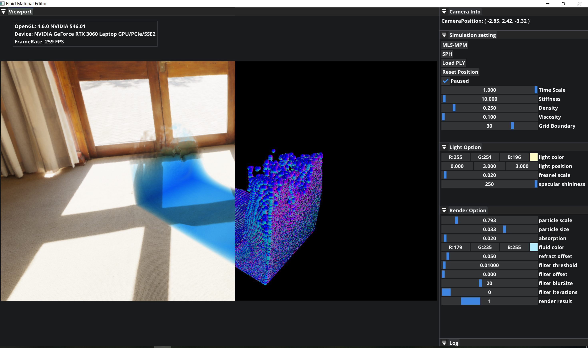

# Fluid-Material-Editor

[日本語](README.md) | [简体中文](README_zh_CN.md) 

大学の卒業制作で作ったリアルタイム流体シミュレーションツールです。

| プラットフォーム   | Windows10                                                    |
| ------------------ | ------------------------------------------------------------ |
| プログラミング言語 | C++                                                          |
| グラフィックスAPI  | OpenGL 4.6                                                   |
| 使用ライブラリ     | [GLFW](https://github.com/glfw/glfw)，<br />[GLM](https://github.com/g-truc/glm)，<br />[spdlog](https://github.com/gabime/spdlog)，<br />[tinyply](https://github.com/ddiakopoulos/tinyply)，<br />[ImGui](https://github.com/ocornut/imgui)，<br />[Premake](https://github.com/premake/premake-core) |

## ビルド

1. [Premake](https://premake.github.io/)をダウンロード
2. プロジェクトファイル生成

	```powershell
	// Windows
	call premake5 vs2022
	```

## 実現機能

* 流体シミュレーション（SPH / MLS-MPM）
* 背景と流体の描画
* 点群ファイルのロード
* デバイス情報やフレームレートの表示
* ログ機能



## プロジェクト構成

| ファイル       | 説明                                                         |
| -------------- | ------------------------------------------------------------ |
| assets         | フォント、CubeMap，Shader                                    |
| vendors        | オープンソースライブラリ                                     |
| src            | `main`、PCH、ソースコード                                    |
| src/core       | `Logger`、`Application`、`Layer`、マクロ                     |
| src/platform   | プラットフォーム関連のクラス                                 |
| src/renderer   | 描画レイヤー：`Camera`、`Mesh`、`Renderer`、`Texture`、`Shader` |
| src/simulation | 物理シミュレーションレイヤー                                 |

## 改善点

* 点群ファイルをファイル選択画面で選べるようにする
* SPH法の性能の改善
* パーティクルの初期位置を調節可能にする
* マウス操作で流体に外力を与えれる様ににする

## 参考資料

ソフトウェアデザインは[The Cherno ゲームエンジン](https://youtu.be/JxIZbV_XjAs?si=Yb95kFDAnnzD92Wn)シリーズを勉強しました。

流体シミュレーションの実現は以下の記事と関連の論文を参考しました：

- [mpm guide](https://nialltl.neocities.org/articles/mpm_guide)
- [WebGPU Fluid Simulations: High Performance & Real-Time Rendering](https://tympanus.net/codrops/2025/02/26/webgpu-fluid-simulations-high-performance-real-time-rendering/)
- [おいもログ-解説: Jelly](https://blog.oimo.io/2022/05/11/mls-mpm-elastic/)
