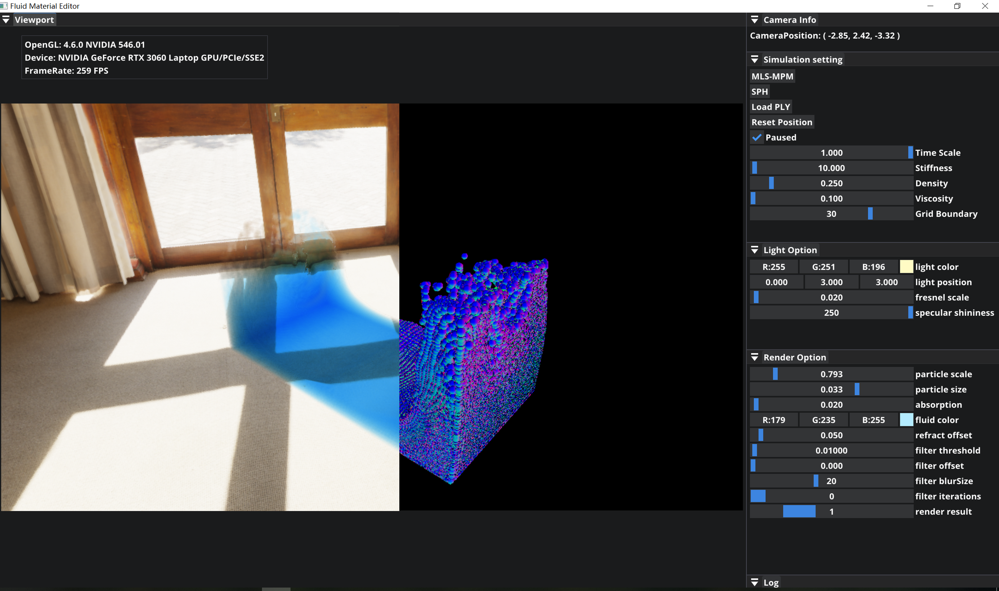

# Fluid-Material-Editor

[日本語](README.md) | [简体中文](README.zh_CN.md) 

大学本科毕业设计-材质可编辑的流体渲染工具设计与开发

| 实现平台 | Windows10                                                    |
| -------- | ------------------------------------------------------------ |
| 编程语言 | C++                                                          |
| 图形API  | OpenGL 4.6                                                   |
| 依赖     | [GLFW](https://github.com/glfw/glfw)，<br />[GLM](https://github.com/g-truc/glm)，<br />[spdlog](https://github.com/gabime/spdlog)，<br />[tinyply](https://github.com/ddiakopoulos/tinyply)，<br />[ImGui](https://github.com/ocornut/imgui)，<br />[Premake](https://github.com/premake/premake-core) |

## 构建

1. 下载[Premake](https://premake.github.io/)

2. 构建项目

   ```powershell
   // Windows
   call premake5 vs2022
   ```

## 功能一览

* 流体模拟（SPH / MLS-MPM）
* 场景渲染
* 点云文件读取
* 帧率与设备信息显示
* 日志输出



## 项目结构

| 目录           | 说明                                                      |
| -------------- | --------------------------------------------------------- |
| assets         | 字体、CubeMap，Shader程序                                 |
| vendors        | 依赖库                                                    |
| src            | `main`，预编译头文件以及二级目录                          |
| src/core       | `Logger`，`Application`，`Layer`，宏                      |
| src/platform   | 平台相关类                                                |
| src/renderer   | 渲染层，`Camera`，`Mesh`，`Renderer`，`Texture`，`Shader` |
| src/simulation | 物理模拟层                                                |

## 参考资料

软件架构参考了[The Cherno游戏引擎系列教程](https://youtu.be/JxIZbV_XjAs?si=Yb95kFDAnnzD92Wn)。

流体模拟的实现参考了以下文章和其中提及的论文：

- [mpm guide](https://nialltl.neocities.org/articles/mpm_guide)
- [WebGPU Fluid Simulations: High Performance & Real-Time Rendering](https://tympanus.net/codrops/2025/02/26/webgpu-fluid-simulations-high-performance-real-time-rendering/)
- [おいもログ-解説: Jelly](https://blog.oimo.io/2022/05/11/mls-mpm-elastic/)
